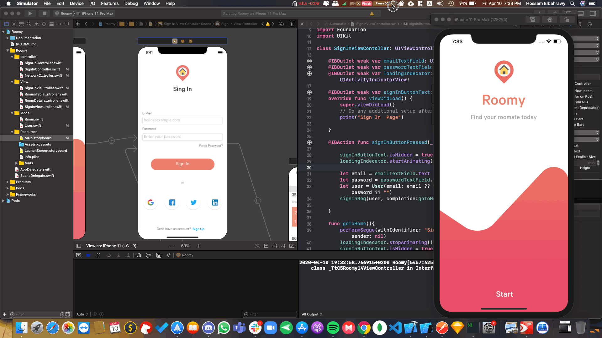
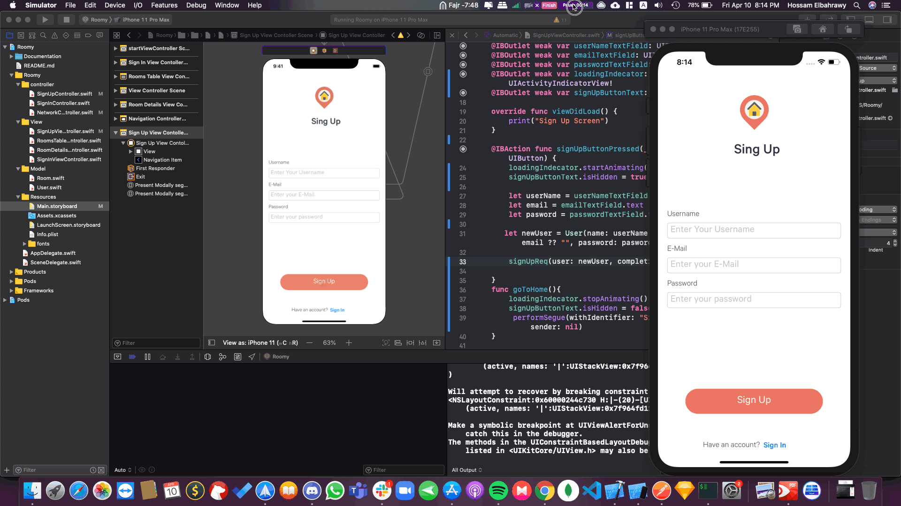
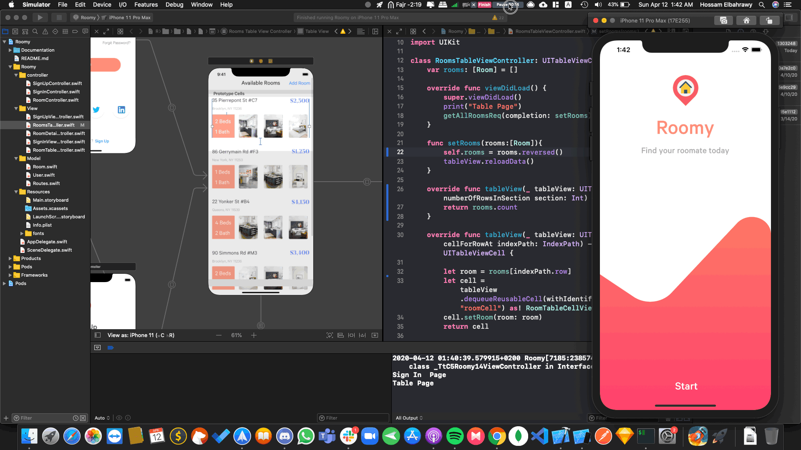

# ROOMY APP
 

## Introduction
Application for finding roomamtes online built using Swift 5 & IOS13

## To-Do
- [x] Launch Screen
- [x] Landing Screen
- [x] Signin Screen
- [x] Rooms Screen
- [x] Details Screen
- [x] Signup Screen
- [ ] Add New Room Screen
- [x] Sign Up API
- [x] Sign In API
- [x] Store Auth Token using keychain
- [ ] Add New Room API
- [x] Get All Rooms API

## Screenshots

### Sign In Screen

### Sign Up Screen

### Rooms Screen

### Details Screen

Support
------
Please feel free to contact me if you have any questions/concerns. My email address: hossamelbahrawy52@gmail.com
